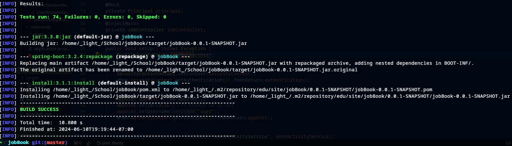

# jobBook Application

| Project Members  | Area  |
|------------------|-------|
| Dillon Gaughan   | User  |
| Ravi Dhondkar    | Job   |
| Alexander Lazarov| Company |
| Malav Padhya     | Post  |





## **Purpose**:

We have decided to create a Job Search web application similar to linked in. Our goal is to
create a functional prototype that allows users to create a profile, search for jobs, and interact
with employers.

## **Conflict Resolution**:

We can resolve conflicts internally by discussing them as a group as needed in our chat or during the meeting. If need be we can contact the professor for guidance.

## **Communication Mechanism**:

We have chosen discord as our communication mechanism as it meets all of our needs. We will have one official meeting a week and stay in consistent.

## **Decision Made**:

| Category              | Choice       | Alternative  |  Decision Date |
|-----------------------|--------------|--------------|----------------|
| **IDE**               | VSCode       | IntelliJ     |  04/13/24      |
| **Dependency Management** | Maven    | Gradle       |  04/13/24      |
| **Code**              | Lombok for reducing boilerplate code; JUnit for unit testing | implement boilerplate code manually | 04/13/24  |
| **Configuration Management** |  application.properties | yml | 04/13/24    |
| **Doucmentation**     | OpenAPI, Swagger | Javadocs |   05/03/24     |
| **Database**          | h2           | mariadb      |   04/24/24     |
| **NoSql**           |Redis         | mongoDB      |   05/10/24     |
| **HTML Template**           |ThymeLeaf & Bootstrap | Pure Html|   05/10/24     |


## **Lessons Learned**:

Currently our project uses the H2 database, which we have found much easier to use than our original plan of using mariadb. 
This change allowed us to speed up our development marginally, gaining insight into how using APIs with a lower learning curve can be beneficial under deadlines.

1. We learned how to implement an SQL to develop a database for our data.
2. We learned how to use JPA to model data objects to represent the data we wanted to store and how to handle it.
3. We learned how to setup a docker environment to build our database for our projects.
4. We learned how to set-up a static website with springboot as our backend and Bootstrap and ThymeLeaf for our front end.
5. We learned how to setup noSQL with redis for alternate data objects to support existing data.
6. We learned hot to setup Springboot security withour Springboot project to establish 7. authentication and authorization.
7. We learned how to use the applications.properties to setup configuration for our Springboot environment.
8. We learned how to establish a controller to create a CRUD application.
9. We learned how to use Lombok For boilerplate code reduction.
10. We learned Model view control for handling http requests and responses.
## How to Use This Project

### Prerequisites

- Java 21
- Maven (for dependency management)
- Docker (for running databases.)

### Setup and Installation


1. Clone the repository:
   ```bash
   git clone https://github.com/yourgithubusername/jobsearchapp.git
2. Navigate to the project directory
   ```bash
   cd jobBook
3. Build the application   
   ```bash
   mvn package
4. Start Docker: 
   ```bash
   docker-compose -f {"path to docker file"}\docker-compose.yml up -d
5. Run the application
   ```bash
   mvn spring-boot:run
6. To access the UI, go to your browser and navigate to:
   ```bash
   http://localhost:8080/
   ```
7. Choose whether to login as Admin or default1/2(Admin has root privileges)
   ```bash
   -on login enter either username: admin & password: admin or username: default1/2 & password: password
   ```

